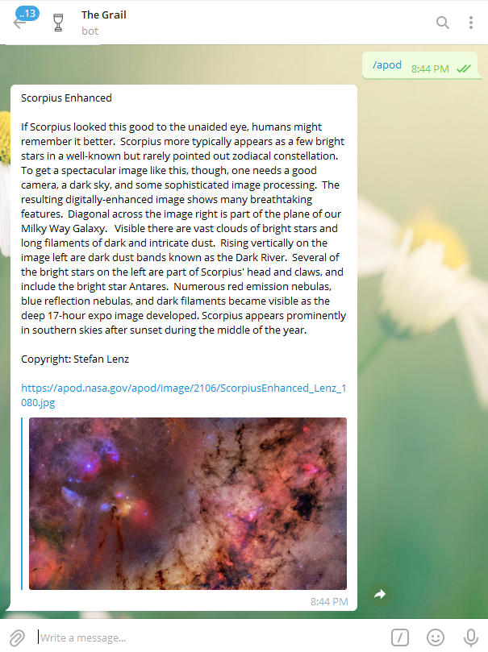
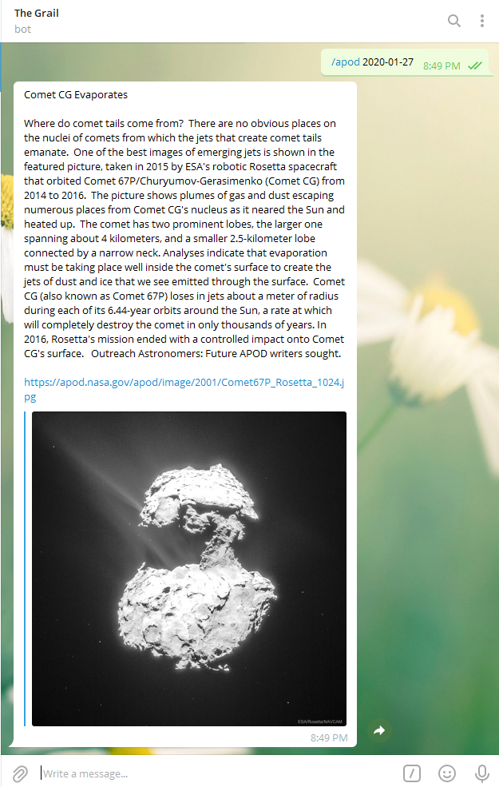

<h1>Astronomy Picture of the Day </h1>
<p>
  
  <a href="https://github.com/RCReddyN/apod/blob/master/LICENSE">
    
  </a>
</p>

<p> Each day a different image or photograph of our universe is featured, along with a brief explanation written by a professional astronomer.</p>


<p> Get your API token from NASA's open API and put it in the ".env" file.</p>

## Install

```sh
pip install -r requirements.txt
```

## Usage

```sh
python main.py
```
## Working
<ul>
<li> Get a demo from a <a href = "https://telegram.me/thegrailbot">telegram bot</a> I wrote.
<li> Type in the command <b>"/apod"</b> with or without the date in the format YYYY-MM-DD.
</ul>
<div align="center">
<h3>Without date parameter</h3>

</div>
<br>

<div align="center"><h3>With date as parameter</h3>

</div>

## Author

👤 **Ravi Chandra Reddy N**

* Website: rcreddyn.github.io
* Github: [@RCReddyN](https://github.com/RCReddyN)
